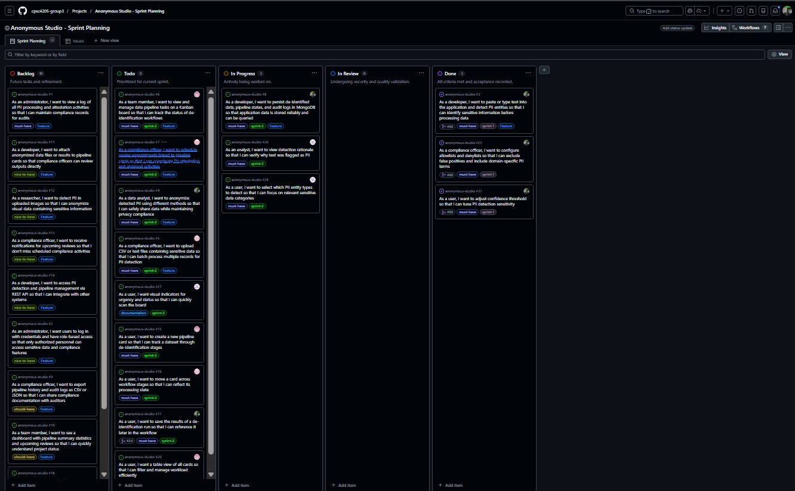
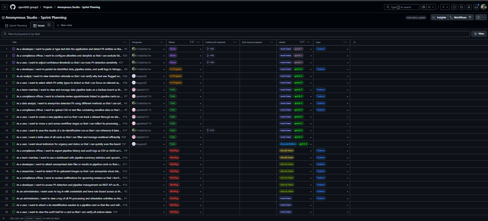

# Sprint 1 Retrospective

**Team Name:** Group 3 - Anonymous Studio 

**Sprint Number:** 1

**Date Range:** 2/11/26 - 2/22/26  

**Team Members:** Carley Fant, Diamond Hogans, Sakshi Patel, Elijah Jenkins

---

## Sprint Summary

**This document enhances the original retrospective draft stored in Jira.**

This sprint focused on establishing the core PII detection functionality for Anonymous Studio. The team aimed to implement basic text input detection using Microsoft Presidio, add support for adjusting confidence thresholds, and create allowlist/denylist configuration features. Although the core detection features were completed, the team encountered significant challenges with coordination and workload distribution. Improving team-wide engagement will be essential to maintaining our current momentum as the project's complexity increases.

## GitHub Project Board Review

### Board View

### Table View

| Metric | Count |
|--------|-------|
| Tasks Planned at Sprint Start | 3 |
| Tasks Completed | 3 |
| Tasks Not Completed | 0 |

### Completed Tasks:
- **Issue #3** - PII text detection: Integrated Microsoft Presidio for detecting names, emails, phone numbers, and SSNs
- **Issue #25** - Allowlist/Denylist: Users can now exclude false positives and add domain-specific terms
- **Issue #27** - Confidence threshold: Added slider for adjusting detection sensitivity (0.0-1.0)

### Scope Changes:
Several infrastructure tasks were added mid-sprint:
- Branch protection rules and CONTRIBUTING guide
- Dependabot configuration for security updates
- Code scanning alert fixes (cyclic imports, redundant assignments)

These were necessary DevOps improvements. Going forward, we will account for recurring maintenance tasks in our sprint planning.

---

## Sprint Planning vs. Reality

### Planned vs. Completed Work
The planned feature work (3 issues) was completed. However, the workload was not distributed as originally planned in the issue assignments.

### Revised Sprint Planning vs. Reality
The actual work completed was technically aligned with our initial goals for PII detection; however, the sprint reality differed significantly from our plan regarding resource allocation. While the technical tasks were scoped appropriately—meaning they weren't too large or too small for a 4-person team—the workload fell on only two members.

In terms of responsibility, there was a clear initial plan, but the lack of communication from half the team created a gap between expectations and execution. As a result, the active contributors had to take on extra work to cover the project's proposal, sprint planning, and technical/DevOps tasks that were not originally distributed this way.

### Contribution Distribution
Based on the GitHub contributor data:
- Carley Fant: 59 commits
- Diamond Hogans: 1 commit
- Sakshi Patel: 0 commits
- Elijah Jenkins: 0 commits

**Two out of four team members have not yet made any contributions to the project.** As a team, we need to discuss what barriers exist and how we can better support each other in Sprint 2.

### Task Scoping
The tasks were appropriately sized for a 4-person team working collaboratively.

---

## What Went Well

1. **Core functionality delivered** - All three planned PII detection features were completed and working
2. **Strong DevOps foundation** - Branch protection, automated workflows, and security scanning were set up early
3. **Clear issue documentation** - User stories included acceptance criteria, technical notes, and code examples to help onboard team members

---

## What Didn't Go Well

1. **Uneven contribution distribution** - The commit history shows work was not distributed across the team as planned. This created an unsustainable workload imbalance.
2. **Communication gaps** - As a team, we did not check in frequently enough to identify blockers or coordination issues early
3. **Assigned subtasks not completed** - Issue descriptions included team member assignments, but these weren't followed through on

---

## Action Items for Next Sprint

1. **Weekly team check-ins with status updates**  
   - Assigned to: All team members  
   - Everyone posts a brief written update by Wednesday each week

2. **Each team member aims for at least 1 merged PR per week**  
   - Assigned to: All team members  
   - We'll each take ownership of specific Sprint 2 issues and commit to pushing code

3. **Team sync meeting to discuss blockers**  
   - Assigned to: All team members  
   - Schedule a call or meeting to talk through what's been preventing contributions and how we can help each other

---

## Individual Reflections

**Carley Fant:**  
This sprint I worked on implementing the PII detection features and setting up the repository infrastructure. For next sprint, I want to focus on better team communication and making sure we're all on the same page about task ownership from the start.

**Diamond Hogans:**  
[Please add 2-4 sentences about your contribution this sprint and one thing you want to improve next sprint]

**Sakshi Patel:**  
[Please add 2-4 sentences about your contribution this sprint and one thing you want to improve next sprint]

**Elijah Jenkins:**  
[Please add 2-4 sentences about your contribution this sprint and one thing you want to improve next sprint]

---

## Contribution Transparency Note

Per the assignment guidelines, we are documenting that two team members (Sakshi Patel and Elijah Jenkins) have not yet made code contributions to the repository. The team is addressing this through the action items above for Sprint 2.

Commit history: [View on GitHub](https://github.com/cpsc4205-group3/anonymous-studio/commits/main)
